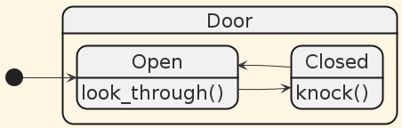
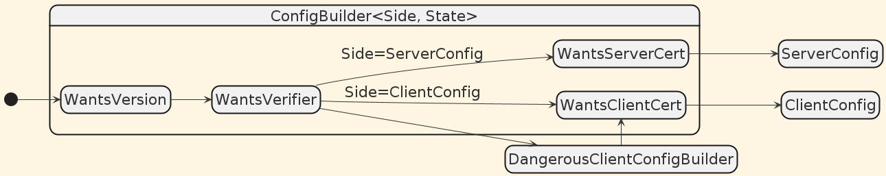
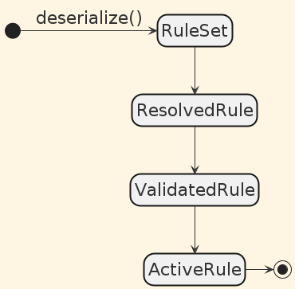

<!-- header: ' '-->

<style>
.row {
  display: flex;
}

.column {
  flex: 50%;
}
</style>

<div style="text-align: center; padding: 200px 0">
    <h1>When to (<strong>not</strong>) use type state</h1>
</div>

---

<div style="text-align: center; padding: 200px 0">
    <h1>When to (<strong>not</strong>) use type state*</h1>
</div>

<div style="text-align: center">
*<em>pattern (<a ref="https://dl.acm.org/doi/10.1145/567067.567093">1</a>)</em>
</div>

---

# About me

- Name: Matthias Farnbauer-Schmidt (he/him)
- Started using Rust in summer 2018
- Software Developer @ Paessler AG since 07.2021
- Lead maintainer of internal crates
- Host of our internal Paessler Rust Meetup

Online:
- GitHub: @MattesWhite
- URLO: farnbams

---


---

# What is typestate?

1. Encode _run-time_ state in _compile-time_ types
2. Operations are only available in associated states
3. Using operations that are not available in a state cause<br>_compile-time_ errors
4. State transitions make the previous state unaccessible

([2])

---

# Implementation

<div style="text-align: center; padding: 50px 0">
    
</div>

<div style="text-align: center">
    <h1>demo 🎉</h1>
</div>

---

# When to use typestate?

## Benefits

➕ Encode application logic in the type system
➕ Move errors from _run-time_ to _compile-time_
➕ Remove _run-time_ checks
➕ Good IDE integration
➕ Self documentation
➕ Helps with Compiler-Driven-Development ([3])
➕ Enforce order of operation

---

# When to use typestate?

➕ Builder pattern, e.g. [`rustls::ConfigBuilder`](https://docs.rs/rustls/latest/rustls/struct.ConfigBuilder.html)

```rust
struct ConfigBuilder<Side: ConfigSide, State> { ... }
```



---

# When to use typestate?

➕ Builder pattern, e.g. [`rustls::ConfigBuilder`](https://docs.rs/rustls/latest/rustls/struct.ConfigBuilder.html)

```rust
struct ConfigBuilder<Side: ConfigSide, State> { ... }
```


```rust
config.dangerous().with_custom_certificate_verifier(my_cert_verifier)
```

---

# When to use typestate?

➕ Transformation and validation, e.g. user input

<div class="row">
<div class="column">

```yaml
receivers:
  syslog_port:
    type: udp
    listener: "0.0.0.0:514"

rules:
  forward-syslog:
    receiver: syslog_port
    destination:
      type: udp
      host: syslog.store.org:1514
```
</div>

<div class="column">



</div>
</div>

---

# When to **not** use typestate?

## Disadvantages

➖ Rare pattern in programming
➖ High entry level
➖ Combinatorial explosion
➖ High coupling between states
➖ Treacherous confidence
➖ Dynamic transitions are hard

---

# When to **not** use typestate?

➖ Externally triggered transitions, e.g. network connections

```rust
impl Connection<Connected> {
    fn send(
        self, payload: &[u8],
    ) -> Result<Self, (Connection<Disconnected>, Error)> { ... }
}
let conn = match conn.send(b"Hello, RustFest!") {
    Ok(conn) => conn,
    Err((disconn, err)) => { 
        warn!(%err, "disconnected, try reconnect");
        disconn.connect()?
    },
};
```

---

# Conclusion

The benefits of typestate mainly apply to users

The disadvantages of typestate mainly affect crate authors

➡ Do proper integration tests when using typestate

---

# Resources

- ([1]) Mechanisms for compile-time enforcement of security, Robert E. Storm, 1983, doi: 10.1145/567067.567093
- ([2]) The Typestate Pattern in Rust, Cliff L. Biffle, 2019
- ([3]) Don't just test your code: MODEL IT, No Boilerplate, 2024
- ([4]) Pretty State Machine in Rust, Ana Hoverbear, 2016

[1]: https://dl.acm.org/doi/10.1145/567067.567093
[2]: https://cliffle.com/blog/rust-typestate/
[3]: https://www.youtube.com/watch?v=Kdpfhj3VM04
[4]: https://hoverbear.org/blog/rust-state-machine-pattern/
